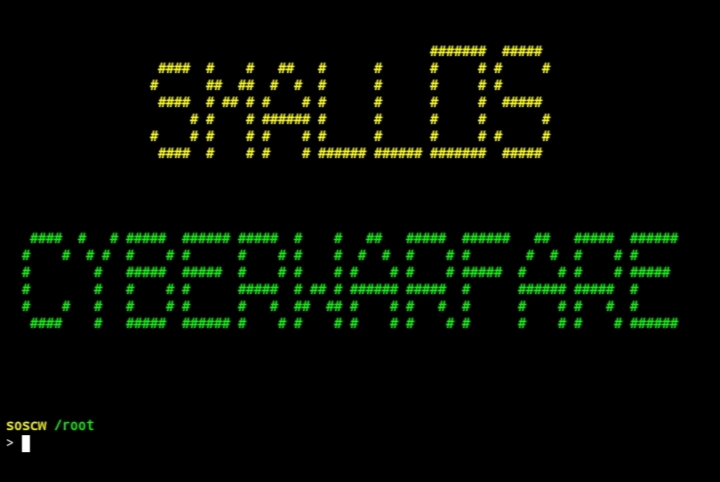
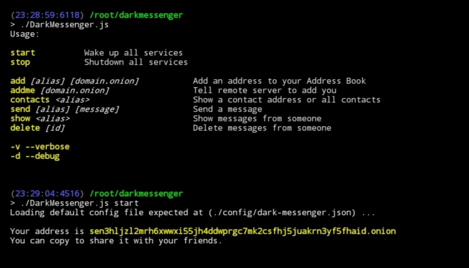
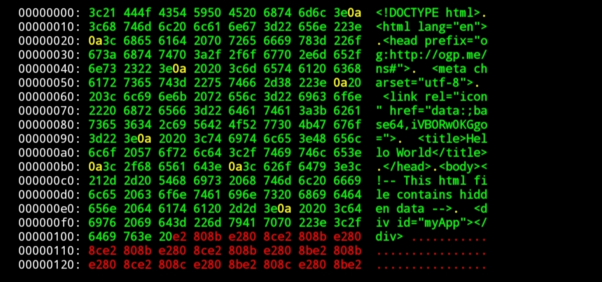
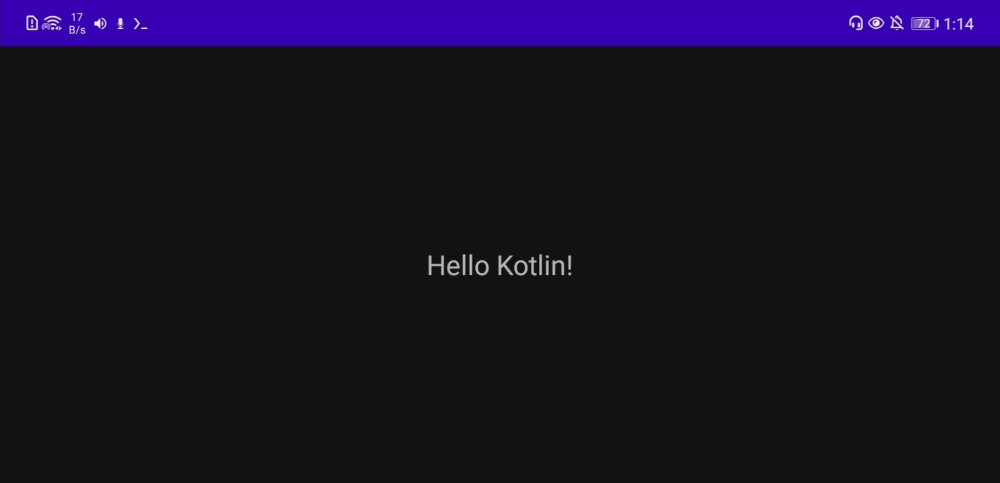

[](https://github.com/stringmanolo)

<!-- [](https://user-badge.committers.top/spain/StringManolo) -->

<!-- [](https://github.com/anuraghazra/github-readme-stats) -->

## Hi there!

I'm StringManolo, a passionate software developer and security enthusiast with a strong focus on creating innovative and secure solutions. With a background in various programming languages and technologies, I aim to contribute to the open-source community and collaborate on exciting projects.

## About Me

I have extensive experience in software development, specializing in:

- **Programming Languages**: Proficient in JavaScript, Bash, C++, and more.
- **Security**: Deep understanding of cybersecurity principles and practices.
- **Open Source**: Active contributor to several open-source projects.

When I'm not coding, you can find me exploring the latest trends in technology, participating in hacking online communities, and sharing knowledge.


# Contact
Feel free to [reach out](https://stringmanolo.github.io/portfolio/#contact) if you'd like to collaborate on a project, have any questions, or just want to connect!


## Donate

If you find my work useful and would like to support me, you can donate via the following methods:
#### Stripe
[Stripe - Similar to PayPal](https://buy.stripe.com/bIY7t6b1z3T857G3cc)

#### XMR:
```
428z8183vxPDnvrU7TKpjmiYjqsknqZGVHzk458KZCnRNQWcfJbEXxd1BUfyQoRX1uPssnynN7KwMh2GMeWfK7BeFp1htMA
```

#### GitHub Sponsor:
[](https://github.com/sponsors/StringManolo)

## Special Thanks

### Sponsors

[](https://github.com/albertobsd) 
[](https://github.com/TeslamegaPower)


-----


### Selected Works

| Project | Preview | Description |
| :--- | :---: | :--- |
| **[Panther](https://github.com/stringmanolo/panther)** |  | Privacy-focused Android browser |
| **[SOSCW](https://github.com/smallOS-cyberwarfare/smallOS-cyberwarfare)** |  | Linux Userland Distro for Hacking  |
| **[Termux Hacking 101](https://github.com/StringManolo/hackingTermux101)** |  | Book about Termux and Hacking |
| **[Dark Messenger](https://github.com/StringManolo/darkmessenger)** |  | Anonymous and decentralized messaging app |
| **[invjsible](https://github.com/StringManolo/invjsible)** |  | Hides data in plain sight with steganography |
| **[StartPage](https://github.com/StringManolo/startpage)** |  | WebApp to use as the home page for browsers |
| **[Kotlin APK Template](https://github.com/StringManolo/KotlinApkTemplate)** |  | Compile Android APKs in 2 minutes - ZERO installation required |

